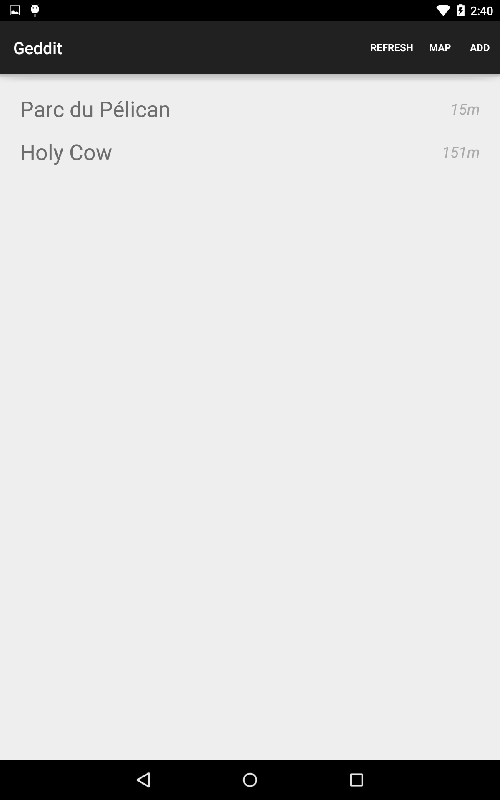
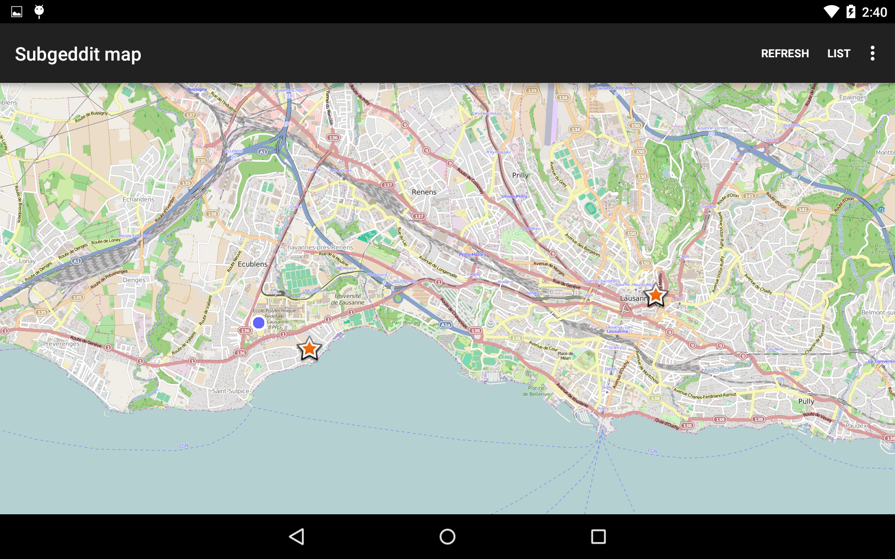
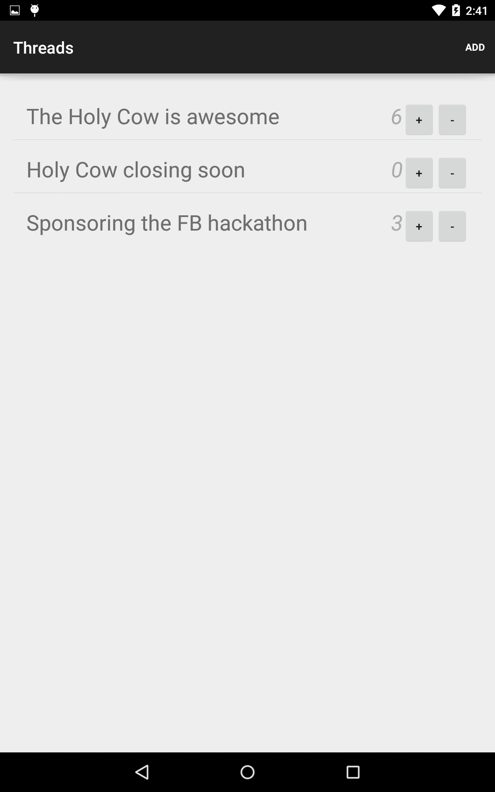
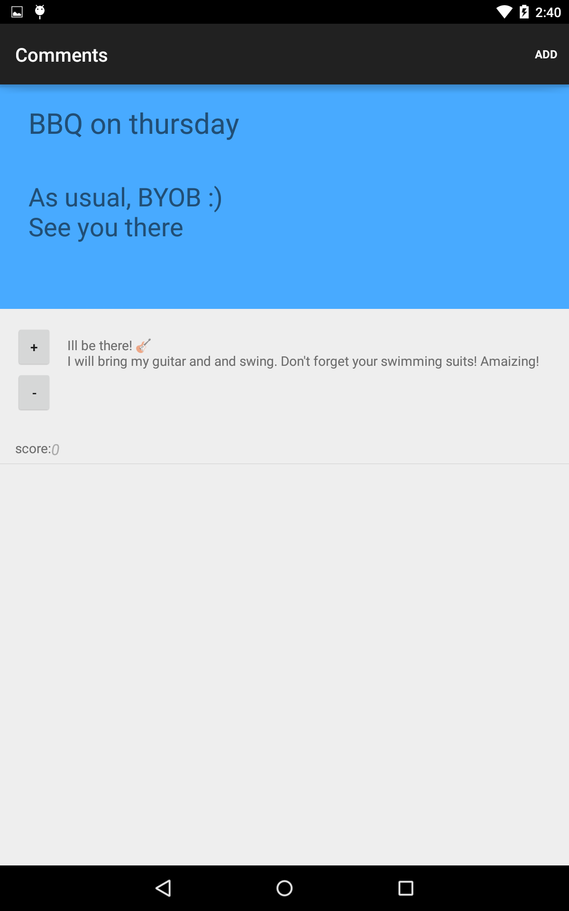

# Geddit

Reddit is a set of subreddit, each subreddit being a thread containing several discussions associated to a single topic. Geddit is like reddit but with subreddits associated to places instead of topics. Imagine you are walking in the street heading for your favorite restaurant. You launch Geddit to find all the surrounding subreddits, you see there is no subreddit associated to your restaurant yet. You can create one, anyone around can see and join it ! Anyone using the app can create discussions about their favorite dish or their best story related to this place, they can post links to photos, videos and upvote or downvote the different discussions. 

# Screenshots

## Main activity of the application

Shows all the sub-geddits around the user

## Map view

Map visualization of the same data

## Threads for a given location

Shows all the conversations for the given subgeddit (~place)

## Thread view

Shows the full thread

